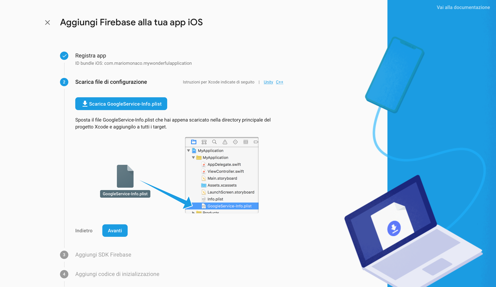
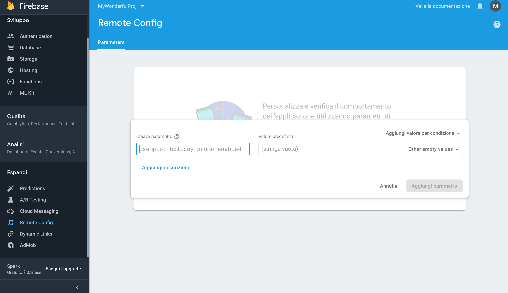

# FirebaseCheckVersion

[](https://cocoapods.org/pods/FirebaseCheckVersion)
[](https://cocoapods.org/pods/FirebaseCheckVersion)
[](https://cocoapods.org/pods/FirebaseCheckVersion)

## Example

To run the example project, clone the repo, and run `pod install` from the Example directory first.

## Requirements

## Installation

FirebaseCheckVersion is available through [CocoaPods](https://cocoapods.org). To install
it, simply add the following line to your Podfile:

```ruby
pod 'FirebaseCheckVersion'
```

## Configuration

First of all you need, if you haven't yet, to create a Firebase Project for your iOS Application.
Go to [Firebase Console](https://console.firebase.google.com) and create your project:


Once you created your project you need to link your iOS Application:


Now fill the bundle id with yours, download the GoogleService-Info.plist that Firebase created for your project and drag it into your xCode Project in this way:



Go now in your AppDelegate.swift file and write ```FirebaseApp.configure()```  how first line of your ```didFinishLaunchingWithOptions:```  method in this way:

```swift
import Firebase
...
func application(_ application: UIApplication, didFinishLaunchingWithOptions launchOptions: [UIApplicationLaunchOptionsKey: Any]?) -> Bool {
    FirebaseApp.configure()
    // Override point for customization after application launch.
    return true
}
```
Done!

## Usage

### Add versions to your Firebase

Once you configured all, you need to set the version on your Firebase Project, so navigate to "Remote Config" section into Firebase and add a new property which key is  ```iOSVersion_<yourVersionWithUnderscore>``` where <yourVersionWithUnderscore> is your version number with underscore instead of points:
Eg.
```
1.0 --> 1_0
1.1 --> 1_1
10.03.9 --> 10_03_9
```

So if your app version is 1.0 simple configure a new Remote Configuration like this:



The possible values you can give to your version are:
1. `versionOk` which means the version is up to date
2. `infoUpdate` which means the version is not the last avaiable, but can be used for your application
3. `forceUpdate` which means the version is not the last avaiable and can NOT be used for your application

### Add check to your application

#### Silent Check

In the UIViewController you want to add the check silently you need to insert these code lines:

```swift
import CheckVersion
...

CheckVersion.check{ result in
    //check result and do what you want
}
```

where `result` is a enum with these possible values:

1. `versionOk` which means your version is currently ok
2. `infoUpdate` which means the version is not the last avaiable, but can be used for your application
3. `forceUpdate` which means the version is not the last avaiable and can NOT be used for your application
4. `versionUnknown` which means your version is not configured on Firebase Console
5. `error` which means an error occurred

#### Alert Check

In the UIViewController you want to add the check with Alert you need to insert these code lines:

```swift
import CheckVersion
...

CheckVersion.checkWithAlert(viewController: self){ result in
    //check result and do what you want
}
```
where `result` is a Bool with value `true` if your version is ok, `false` otherwise.

Info Update             |  Force Update | Error
:-------------------------:|:-------------------------:
  |  | 

### Application Configuration

Is possible to choose some custom library configuration like these:
```swift
import CheckVersion
...

func application(_ application: UIApplication, didFinishLaunchingWithOptions launchOptions: [UIApplicationLaunchOptionsKey: Any]?) -> Bool {
    FirebaseApp.configure()
    CheckVersionConfiguration.default.urlStore = URL(string: "itms-apps://itunes.apple.com/<myAppId>")! //where myAppID is your store application id
    CheckVersionConfiguration.default.continueOnError = false //continue in case of error (default is true)
    CheckVersionConfiguration.default.continueOnVersionUnknown = false //continue in case of version unknown (default is true)
    CheckVersionConfiguration.default.prependKey = "" //the prepend string you can insert in firebase console before (default is 'iOSVersion_')
    CheckVersionConfiguration.default.duration = TimeInterval(120) //the duration of Firebase Remote Configuration Cache (default is 60 seconds)
    // Override point for customization after application launch.
    return true
}
```

Right now the library is localized just in English, so if you want to use built-in alerts is possible to change these configurations property too:

```swift
import CheckVersion
...

func application(_ application: UIApplication, didFinishLaunchingWithOptions launchOptions: [UIApplicationLaunchOptionsKey: Any]?) -> Bool {
    FirebaseApp.configure()
    CheckVersionConfiguration.default.labelAlertError = "Si è verificato un errore generico, per favore riprova più tardi"
    CheckVersionConfiguration.default.labelButtonNotNow = "Non adesso"
    CheckVersionConfiguration.default.labelButtonUpdate = "Aggiorna"
    CheckVersionConfiguration.default.labelForceUpdate = "E' disponibile una nuova versione dell'app: per favore aggiornala adesso"
    CheckVersionConfiguration.default.labelInfoUpdate = "E' disponibile una nuova versione dell'app: se vuoi aggiornala adesso"
    CheckVersionConfiguration.default.labelAlertTitle = "Attenzione"
    CheckVersionConfiguration.default.labelButtonOk = "Ok"
    // Override point for customization after application launch.
    return true
}
```

## Author

Mario Monaco, andoma93@gmail.com

## License

FirebaseCheckVersion is available under the MIT license. See the LICENSE file for more info.
