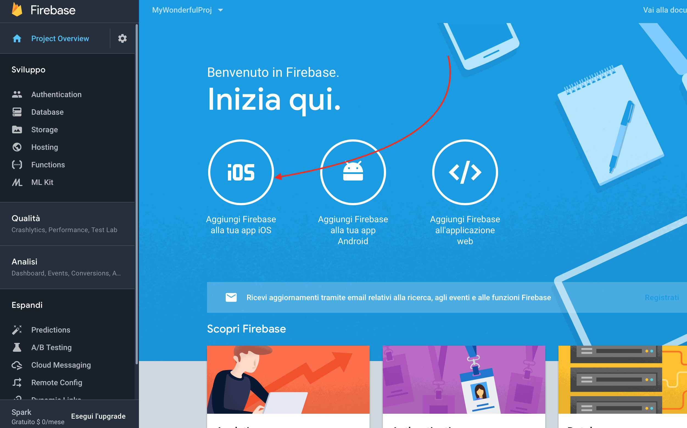

# FirebaseCheckVersion

[](https://cocoapods.org/pods/FirebaseCheckVersion)
[](https://cocoapods.org/pods/FirebaseCheckVersion)
[](https://cocoapods.org/pods/FirebaseCheckVersion)

## Example

To run the example project, clone the repo, and run `pod install` from the Example directory first.

## Requirements

## Installation

CheckVersion is available through [CocoaPods](https://cocoapods.org). To install
it, simply add the following line to your Podfile:

```ruby
pod 'FirebaseCheckVersion'
```

## Configuration

First of all you need, if you haven't yet, to create a Firebase Project for your iOS Application.
Go to [Firebase Console](https://console.firebase.google.com) and create your project:


Once you created your project you need to link your iOS Application:



Now fill the bundle id with yours, download the GoogleService-Info.plist that Firebase created for your project and drag it into your xCode Project in this way:


Go now in your AppDelegate.swift file and write ```FirebaseApp.configure()```  how first line of your ```didFinishLaunchingWithOptions:```  method in this way:

```swift
func application(_ application: UIApplication, didFinishLaunchingWithOptions launchOptions: [UIApplicationLaunchOptionsKey: Any]?) -> Bool {
FirebaseApp.configure()
// Override point for customization after application launch.
return true
}
```

## Author

andoma93, andoma93@gmail.com

## License

CheckVersion is available under the MIT license. See the LICENSE file for more info.
